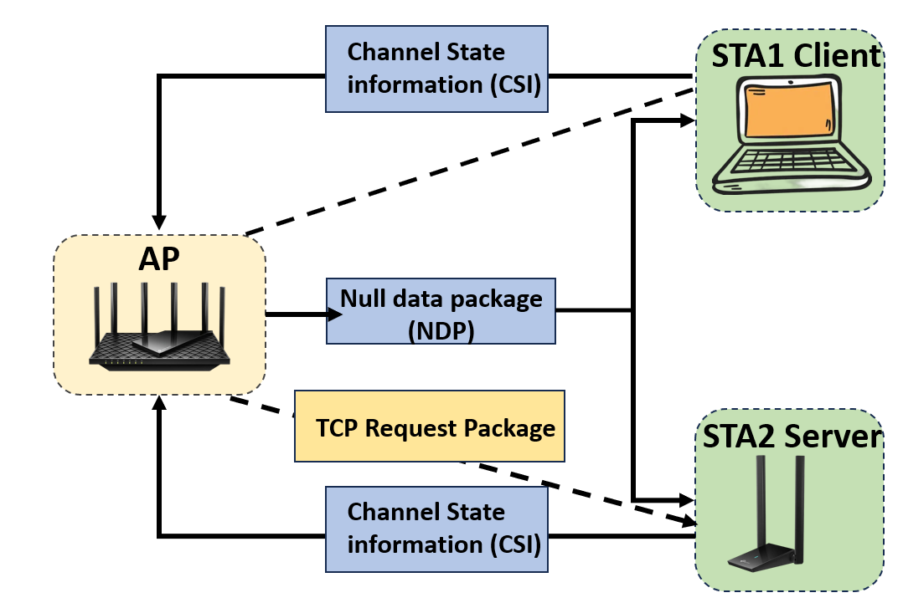
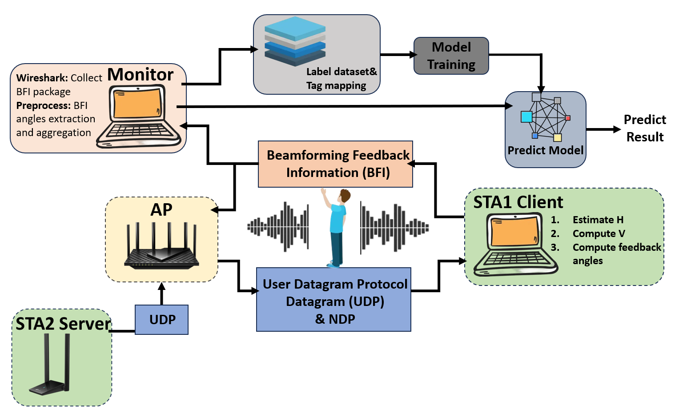
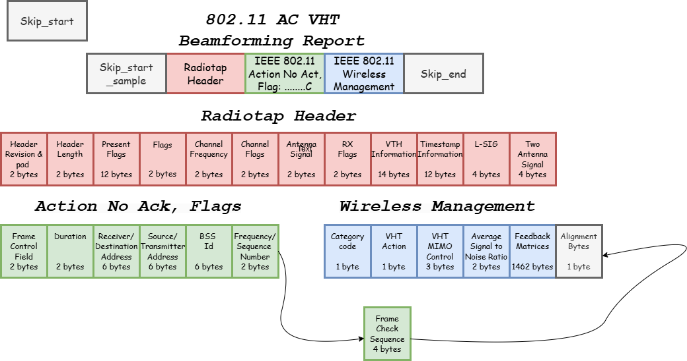

# Gesture-Recognition-based-on-LSTM-network-and-BFM
This project is FYP of university of Liverpool by Yanzhang Wang, which  is about gesture recognition using deep learning and Wi-Fi, supervised by [Junqing Zhang](https://junqing-zhang.github.io/) from September 2024 to April 2025.

Our system utilizes ambient WiFi signals to extract BFI features that capture variations caused by human movements without requiring specialized hardware. We combine CNN for spatial feature extraction with LSTM for temporal pattern recognition in an end-to-end deep learning framework for dynamic gesture recognition. To improve robustness, we implemented a static threshold mechanism that distinguishes between static conditions and dynamic gestures before neural network processing. This hybrid approach enhances accuracy in real-world settings while maintaining end-to-end advantages. Compared to conventional methods, our system provides Non-Line-of-Sight recognition, environmental adaptability, cost-effectiveness, and privacy protection, offering valuable solutions for smart homes, health monitoring, and interactive applications.

## Setup

### Experimental hardware equipment 

- TP-Link AX5400 WiFi 6 Router
- UGREEN WiFi Adapter
- TP-Link USB WiFi Adapter
- 2x Intel Wi-Fi 6E Ax210

### Software

- Wireshark
- Iperf3
- iwconfig

WiFi details

## Recognition system Framework

Our system uses a dual-phase approach for gesture recognition via WiFi signals. In phase one, the AP exchanges CSI with both stations while STA2 Server sends UDP packets to trigger high throughput NDP transmissions, enabling BFI collection from standard WiFi communications. In phase two, collected BFI data undergoes preprocessing and flows through our CNN-LSTM deep learning pipeline, which extracts spatial-temporal features from the wireless signal variations caused by human gestures, ultimately producing accurate recognition results without specialized sensing hardware.

## BFI Collection

### Step 1: ubuntu NIC 1 as iperf3 server: Step 2: ubuntu NIC 2 as monitor: 

`iperf3 -s -i 1 -p <port>`  `sudo airmon-ng start <wlan name>`

eg. `iperf3 -s -i 1 -p 2222`eg. `sudo airmon-ng start wlo1mon` (Open it wireshark) 

### Step 3: windows as iperf3 client:

`iperf3 -c <server address> -B <client address> -i 1 -R -t <time/s> -p <port> `

eg. `iperf3 -c 192.168.0.95 -B 192.168.0.94 -i -R -t 120 -p 3333`

### Step 4: Choose specific channel to listen on:

`sudo iwoconfig <wlan name> channel <channel number>`

eg. `sudo iwconfig wlo1mon channel`

### Step 5: Open wireshark and choose the monitor and apply the filter:

`wlan.sa == <'mac address'> && frame.len == <'package length'> `

Or use the collection demo directly which contain the step 2, step 4 and step 5.

`./angle_collection.sh <'directory to save live captures'>  <'network interface with which you want to monitor (maybe your PC's network card)'>  <'bandwidth'> <'update interval'>`

eg. `./angle_collection.sh dataset wlo1 48 80MHz 1`

## BFA Extract

After collecting the BFI through wireshark, then the dataset will be kept into pcapng file, which is constituted as the below table for another's wifi setting:

Then, extract the BFA through the 

and get the npy file which contain the V matrices in the V_matrices folder and other npy file which contain the beamforming feedback angles(bfa) in the bfa folder.

## Train the dataset with different Leaning Model

Firstly, go to Python_code folder through:

`cd Python_code`

Then, run the learning model through:

`python learning.py <'directory of the beamforming feedback matrices dataset'> <'ID of the beamformee position in {1, ..., 9}'> <'name for the model to be saved'> <'number of transmitter antennas'> <'number of receiver antennas'> <'indices of the transmitter antennas to consider, comma separated'> <'indices of the receiver antennas to consider, comma separated'> <'bandwidth'> <'name of network model'> <'prefix to identify the data'> <'scenario considered in {S1, S2, S3, S4, S4_diff, S5, S6, hyper}'>`

## Predict model

